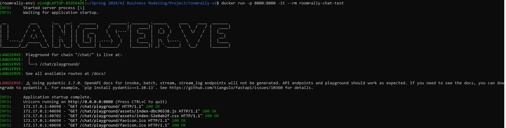
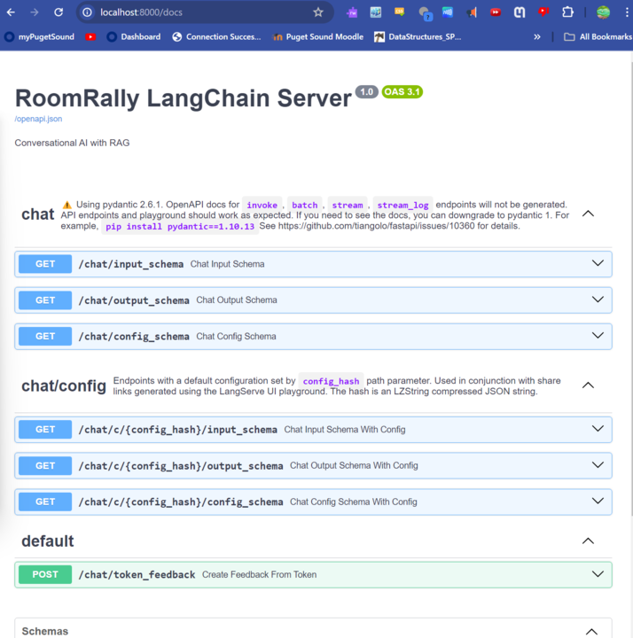
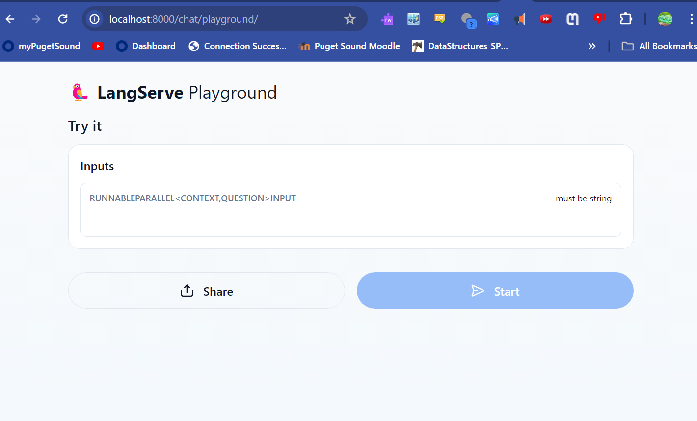

# RoomRally Chat 

## Installation

Install the LangChain CLI if you haven't yet

```bash
pip install -U langchain-cli
```

## Adding packages

```bash
# adding packages from 
# https://github.com/langchain-ai/langchain/tree/master/templates
langchain app add $PROJECT_NAME

# adding custom GitHub repo packages
langchain app add --repo $OWNER/$REPO
# or with whole git string (supports other git providers):
# langchain app add git+https://github.com/hwchase17/chain-of-verification

# with a custom api mount point (defaults to `/{package_name}`)
langchain app add $PROJECT_NAME --api_path=/my/custom/path/rag
```

Note: you remove packages by their api path

```bash
langchain app remove my/custom/path/rag
```

## Setup LangSmith (Optional)
LangSmith will help us trace, monitor and debug LangChain applications. 
LangSmith is currently in private beta, you can sign up [here](https://smith.langchain.com/). 
If you don't have access, you can skip this section


```shell
export LANGCHAIN_TRACING_V2=true
export LANGCHAIN_API_KEY=<your-api-key>
export LANGCHAIN_PROJECT=<your-project>  # if not specified, defaults to "default"
```

## Launch LangServe

```bash
langchain serve
```

## Running in Docker

This project folder includes a Dockerfile that allows you to easily build and host your LangServe app.

This Dockerfile is set up to take in the following files you must add in the project folder:

*GCP-Key.json*

and

*.env*

```shell
# .env
PROJECT_ID=your_project_id
REGION=us-central1
BUCKET_URI=your_bucket
GOOGLE_APPLICATION_CREDENTIALS="./GCP-Key.json"
```
### Building the Image

To build the image, you simply:

```shell
docker build . -t roomrally-chat
```

If you tag your image with something other than `roomrally-chat`,
note it for use in the next step.

### Running the Image Locally

To run the image, you'll need to include any environment variables
necessary for your application.

In the below example, additional environment variables like `OPENAI_API_KEY` can be set with '-e'with the value set in my local environment.
(-e OPENAI_API_KEY=`$OPENAI_API_KEY`)

However since we must sepecify our Google credentials key.json and .env with parameters for 

We need to expose port 8080 with the `-p 8080:8080` option.

```shell
docker run -p 8080:8080 -it --rm roomrally-chat
```







### Running the Image on Google Cloud Platform
After making your image 

```shell
docker tag [local-image-name] gcr.io/[your-project-id]/[your-image-name]
```

```shell
docker push gcr.io/[your-project-id]/[your-image-name]
```

```shell
gcloud run deploy [your-service-name] \
    --image gcr.io/[your-project-id]/[your-image-name] \
    --port 8080 \
    --allow-unauthenticated \
    --region us-central1
```

After deployment, Google Cloud Run provides the public URL of your service. You can also retrieve it using:

```shell
gcloud run services describe [your-service-name] \
   --platform managed \
   --region [your-preferred-region] \
   --format "value(status.url)"
```